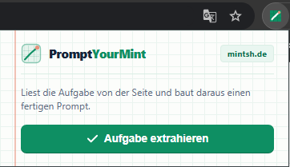
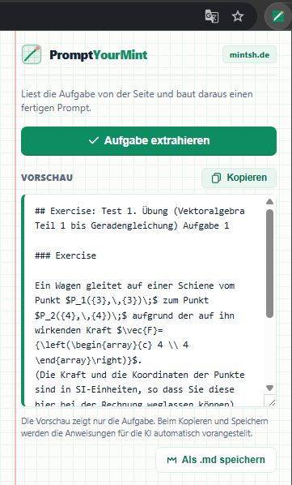
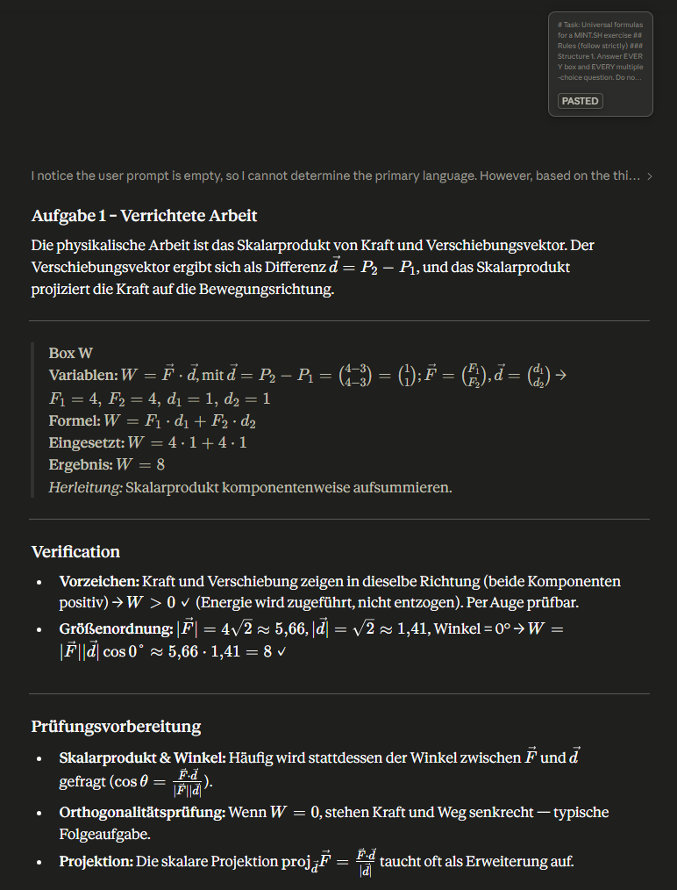

<div align="center">
  
  <h1>PromptYourMint</h1>
  <p>A Chrome extension that turns <a href="https://mintsh.de">mintsh.de</a> math exercises into structured AI prompts — instantly.</p>

  
  
  
</div>

---

## What it does

Open any exercise on mintsh.de, click the extension, hit **Aufgabe extrahieren** — and you get a complete, copy-ready prompt for any AI assistant.

The prompt includes:
- The full exercise text with clean LaTeX (`$...$`) instead of raw MathJax HTML
- Multiple-choice options extracted and listed separately
- Matrix input grids rendered as structured `n×m` grids
- Interactive JSXGraph graphs decoded into human-readable line/point descriptions
- Static STACK plots decoded from their alt-text formula lists
- Strict AI instructions: formula first, values substituted, result, derivation note, graph visual check, verification checks, and exam prep tips

The AI rules are **never shown to you** — they're silently prepended when you copy or save, so the preview stays clean.

---

## Screenshots

### Popup on a mintsh.de exercise page


### Extracted exercise preview


### AI output example — with formula, substitution, result, graph check


---

## Installation

> No build step. No npm. Just load it directly.

1. Clone or download this repo
   ```bash
   git clone https://github.com/christianptc/prompt-your-mint.git
   ```
2. Open Chrome and go to `chrome://extensions/`
3. Enable **Developer mode** (toggle in the top-right corner)
4. Click **Load unpacked** and select the repo folder
5. The PromptYourMint icon appears in your toolbar

---

## Usage

1. Open any exercise on **mintsh.de**
2. Click the **PromptYourMint** icon in the toolbar
3. Click **Aufgabe extrahieren**
4. The exercise is extracted and shown in the preview box
5. Click **Kopieren** to copy the full prompt to clipboard, or **Als .md speichern** to download it as a Markdown file
6. Paste into any AI assistant (Claude, ChatGPT, etc.)

The extension is **inactive on all other sites** — the icon only becomes functional on mintsh.de.

---

## What gets extracted

| Element | How it's handled |
|---|---|
| LaTeX math | Extracted from `<script type="math/tex">` — clean source, not rendered HTML |
| Multiple choice / radio buttons | Options collected into a `[Auswahloptionen]` list |
| Text input boxes | Replaced with `___` placeholders |
| Matrix input grids | Rendered as labeled `n×m` grids with row/column structure |
| JSXGraph interactive graphs | Decoded from the iframe `srcdoc` — lines, points, colors, input bindings |
| Static STACK plot images | Decoded from alt-text — function list with legend labels and axis ranges |
| "Diese Felder bitte ignorieren" blocks | Automatically suppressed |

---

## AI prompt structure

Every copied/saved prompt follows this format:

```
# Task: Universal formulas for a MINT.SH exercise
## Rules (follow strictly)
...

## Exercise: Test 4. Übung (...) Aufgabe 7

### Exercise
[exercise text]

### What is asked
[what needs to be solved]
```

The AI is instructed to respond with:

- A brief explanation of the mathematical idea per Teilaufgabe
- Per input box: **Variablen** mapping, **Formel**, **Eingesetzt**, **Ergebnis**
- No repeated explanations for identical steps (`*wie Box [X]*`)
- A **Graphik-Check** section for graph exercises (Y-intercept, slope as p/q fraction, feasible region test point)
- A **Verification** section (1–3 eye-checkable plausibility checks)
- A **Prüfungsvorbereitung** section (related exam topics + extra true statements for multiple-choice)

---

## File structure

```
prompt-your-mint/
├── manifest.json       # Chrome extension manifest (MV3)
├── content.js          # Page scraper — runs on mintsh.de
├── popup.html          # Extension popup UI
├── popup.css           # Styling
├── popup.js            # Popup logic + prompt builder
├── icons/
│   ├── icon16.png
│   ├── icon48.png
│   └── icon128.png
└── screenshots/        # README screenshots (add your own)
```

---

## License

MIT — do whatever you want with it.
